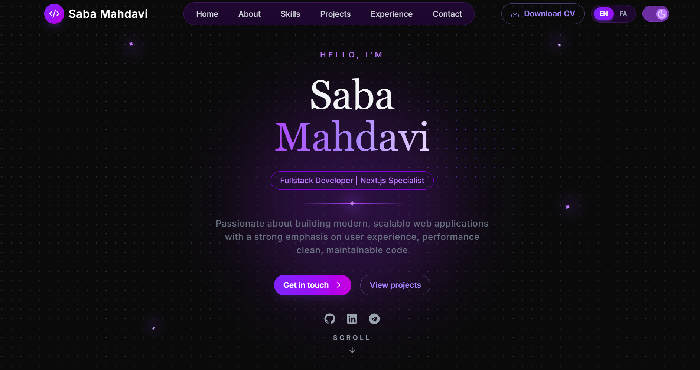
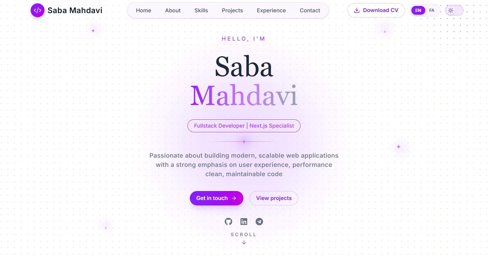

# 💼 Personal Portfolio


<p align="center">
  A modern, responsive, and multilingual portfolio website built with <strong>Next.js 16</strong> to showcase my projects, technical skills, and professional experience.
</p>

<p align="center">
  
  
  
  
</p>

---

## ✨ Features

- 🌙 Dark & Light Theme
- 🌍 Multi-language Support (English, Persian, Arabic)
- 📱 Fully Responsive Design
- ⚡ Built with Next.js 16 App Router
- 🎨 Modern UI with Smooth Animations
- 📂 Featured Projects Showcase
- 👨‍💻 Skills & Experience Sections
- 📧 Contact Section
- 🚀 Optimized Performance

---

## 🛠 Tech Stack

|Category|Technologies|
|---------|--------------|
|Framework|Next.js 16|
|Library|React|
|Language|TypeScript|
|Styling|Tailwind CSS|
|Internationalization|next-intl|
|Deployment|Vercel|

---

## 📸 Screenshots

### Home Page

<!-- <p align="center"> -->
  
  
<!-- </p> -->

---

## 🚀 Getting Started

Clone the repository:

```bash
git clone https://github.com/Sabamahdavi84/portfolio.git
```

Navigate to the project directory:

```bash
cd portfolio/portfolio
```

Install dependencies:

```bash
npm install
```

Run the development server:

```bash
npm run dev
```

Open your browser and visit:

```
http://localhost:3000
```

---

## 📁 Repository Structure

```
Repository
│
├── README.md
├── assets/
│   ├── portfolio-cover.png
│   ├── home-dark.png
│   ├── home-light.png
│   └── projects.png
│
└── portfolio/
    ├── app/
    ├── components/
    ├── public/
    ├── hooks/
    ├── lib/
    ├── messages/
    ├── types/
    ├── package.json
    └── ...
```

---

## 🌐 Live Demo

🔗 **https://sabamahdavi.vercel.app**

---

## 👤 Author

**Saba Mahdavi**

- 💻 GitHub: https://github.com/Sabamahdavi84/portfolio-website
- 🌐 Portfolio: https://sabamahdavi.vercel.app

---

⭐ If you found this project interesting, consider giving it a star!